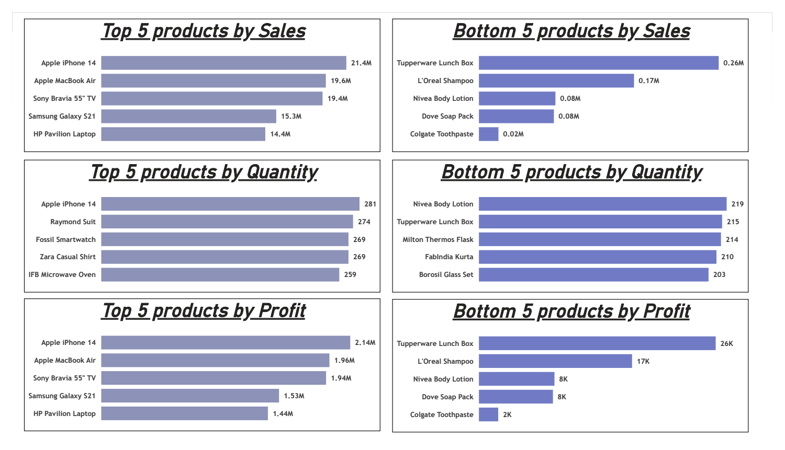
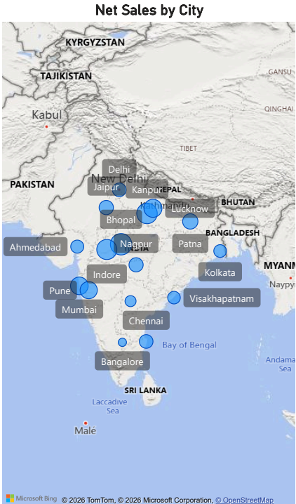
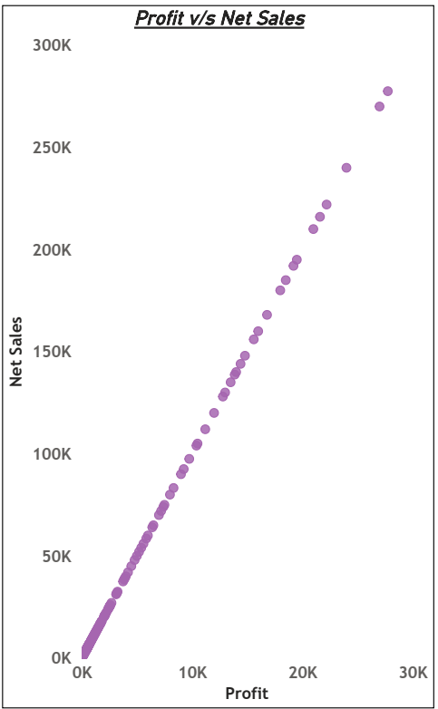
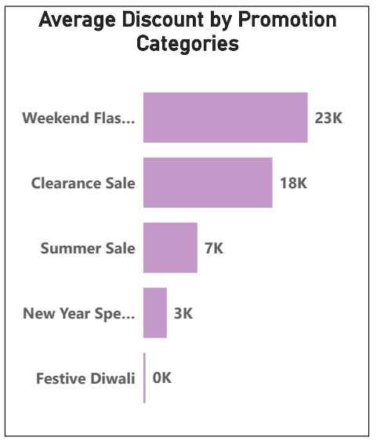
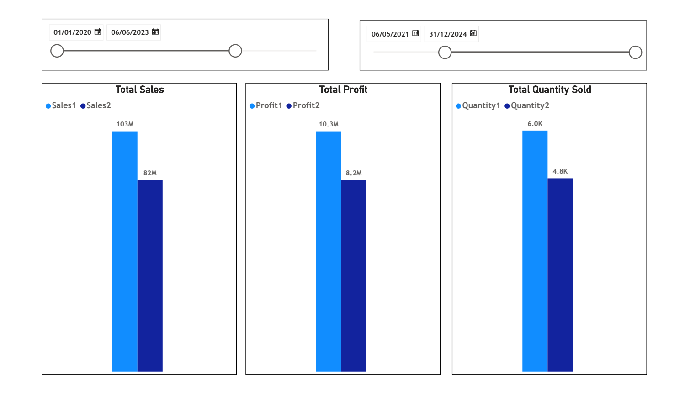
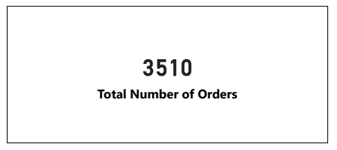
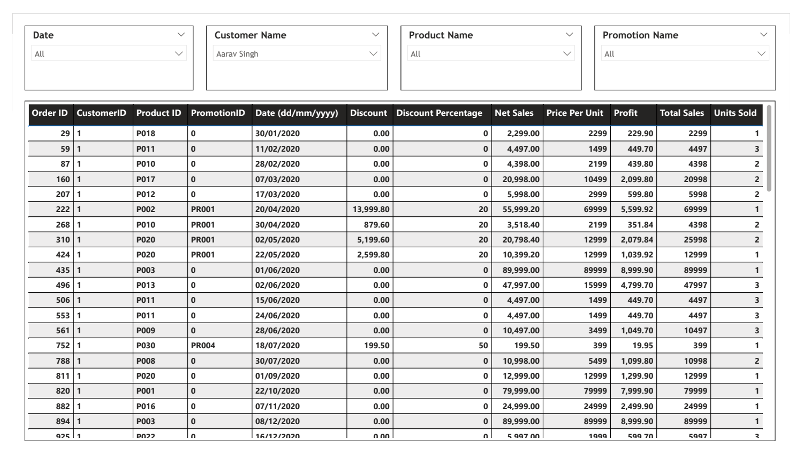

# Sales Data Analysis | Power BI Project

## Project Summary
This project presents an end-to-end Sales Data Analysis solution built using Power BI, focusing on sales performance, profitability, customer behavior, promotions, and time-based comparisons.

The dashboard enables business users to make data-driven decisions through interactive visuals, advanced DAX calculations, and dynamic filtering.

### Business Objectives
- Analyze sales, profit, and quantity trends over time
- Identify top and bottom performing products
- Evaluate promotion effectiveness and discounts
- Compare sales performance across two different time periods
- Understand customer and city-level sales distribution

### Tools & Technologies
- Power BI Desktop 
- DAX
- Power Query (ETL)
- Data Modeling (Star Schema)
- Interactive Filters & Edit Interactions

### Data Model
The project follows a star schema design to ensure optimal performance and scalability.

Tables Used:
- Fact Table (Sales Transactions)
- Dim Product
- Dim Customers
- Dim Promotion
- Date Table 1 (Active)
- Date Table 2 (Inactive – for comparison)

## Dashboard Highlights
- Interactive dashboards for sales, profit, quantity, and promotions analysis to enable period-over-period comparison
- Star schema data model for optimized performance and scalability
- Dual date tables enabling time-based comparison using USERELATIONSHIP()
- Dynamic filtering using slicers and edit interactions
- Combination of KPI cards, clustered column charts, scatter plots, maps, and tables

## How to Use the Dashboard
- Use slicers to filter data by date, customer, product, promotion, and city
- Compare sales performance across two time periods using inactive date relationships
- Identify top and bottom performing products based on sales, profit, and quantity
- Analyze promotion effectiveness using discount and profit visuals
- Drill down into transaction-level details for deeper analysis

## Dashboard Snapshots (Power BI)
### Top & Bottom Products Analysis
Shows Top 5 and Bottom 5 products based on:
- Sales
- Quantity Sold
- Profit

Insights:
- High-revenue products are not always high-quantity products
- Some low-selling products generate minimal profit and may need review

### Sales by City (Geographic Analysis)
Map visualization highlighting Net Sales by City.

Insights:
- Identifies top revenue-generating cities
-Helps in regional sales strategy and expansion planning

### Profit vs Net Sales Relationship
Scatter plot showing correlation between Profit and Net Sales.

Insights:
- Strong positive correlation between profit and net sales
- Helps identify high-value customers and transactions

### Promotion & Discount Analysis
Displays Average Discount by Promotion Category.

Insights:
- Weekend Flash Sales offer the highest average discounts
- Festive promotions show minimal discount impact

### Sales Trends Over Time
Clustered column charts to compare sales, profit, and quantity across different time periods

Insights:
- Clear seasonal and promotional spikes
- Useful for demand forecasting and inventory planning

### Orders Overview
Card visual displaying Total Number of Orders.

Insight:
- Quick snapshot of overall business activity

### Detailed Transaction Table
Fully interactive table showing:
- Order ID
- Customer ID
- Product ID
- Promotion
- Discount
- Net Sales
- Profit
- Quantity Sold

Supports filtering by:
- Date
- Customer Name
- Product Name
- Promotion Name

### Key DAX Concepts Used
- CALCULATE()
- SUM()
- USERELATIONSHIP()
- ALL()
- Time intelligence logic
- Measure tables for clean modeling

### Key Business Insights
- A small number of products drive the majority of revenue
- Discounts significantly impact sales during promotional periods
- High sales volume does not always mean high profitability
- Period comparison reveals clear performance growth patterns

### Outcome
This project demonstrates:
- Strong understanding of Power BI data modeling and DAX
- Ability to analyze sales, profitability, and customer behavior
- Experience building business-ready dashboards for decision-making
- Practical use of time intelligence and promotion analysis

## Skills Demonstrated
- Sales & Business Performance Analysis
- Power BI Dashboard Design
- Data Modeling (Star Schema)
- DAX (Time Intelligence & KPIs)
- Data Cleaning & ETL (Power Query)
- Analytical Storytelling
