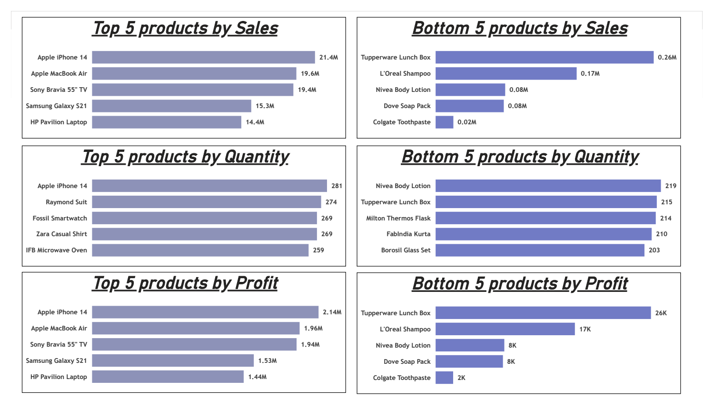
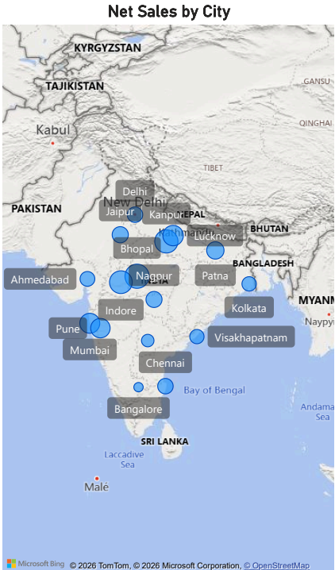
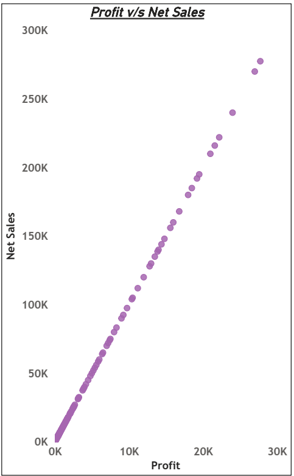
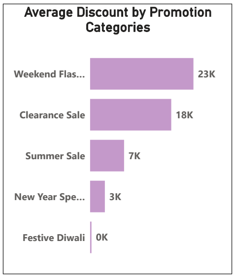
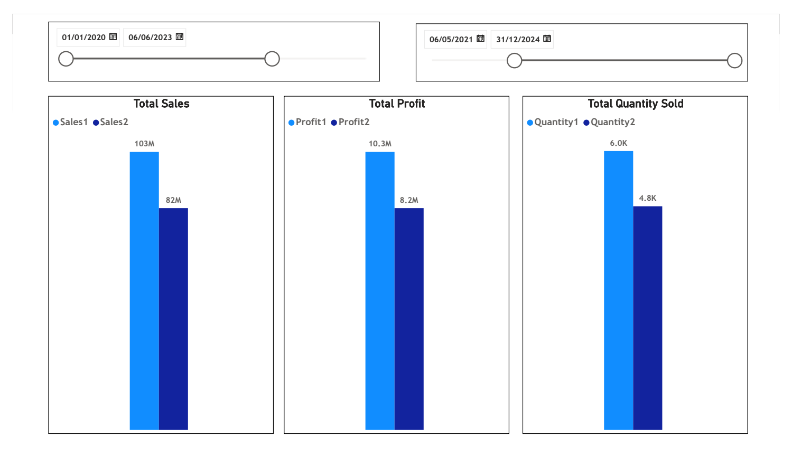
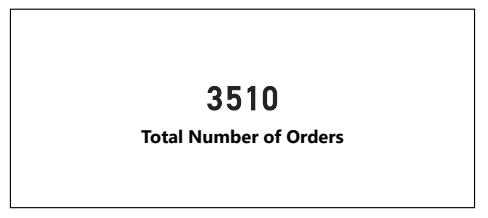

# Sales Data Analysis | Power BI Project
Excel | Power BI | DAX | Data Modeling 

## Project Summary
This project presents an end-to-end Sales Data Analysis solution built using Power BI, focusing on sales performance, profitability, and demand trends.

Microsoft Excel was used for data validation, basic analysis, and cross-checking to ensure data accuracy before visualization. The dashboard enables business users to make data-driven decisions and supports demand analysis for inventory planning.

### Business Objectives
- Analyze sales, profit, and quantity trends over time  
- Identify top and bottom performing products  
- Evaluate promotion effectiveness and discounts  
- Compare sales performance across time periods  
- Support demand analysis for inventory and stock planning  

### Tools & Technologies
- Microsoft Excel (Data validation and cross-checking, basic analysis)  
- Power BI Desktop 
- DAX
- Power Query (ETL)
- Data Modeling (Star Schema)
- Interactive Filters & Edit Interactions

### Data Model
The project follows a star schema design to ensure optimal performance and scalability.

Tables Used:
- Fact Table (Sales Transactions)
- Dim Product
- Dim Customers
- Dim Promotion
- Date Table 1 (Active)
- Date Table 2 (Inactive – for comparison)

## Key Responsibilities  
- Cleaned and transformed raw data using Power Query  
- Performed data validation and cross-checking using Microsoft Excel  
- Built data models to support efficient reporting and analysis  
- Developed DAX measures for sales, profit, and time-based comparisons  
- Designed interactive dashboards to analyze sales trends and product performance  
- Generated insights to support demand analysis and operational decision-making  

## Dashboard Highlights
- Interactive dashboards for sales, profit, quantity, and promotion analysis  
- KPI tracking for performance monitoring  
- Time-based comparison using dual date tables  
- Dynamic filtering with slicers and interactive visuals  
- Combination of charts, maps, and tables for detailed analysis

## How to Use the Dashboard
- Use slicers to filter data by date, customer, product, promotion, and city
- Compare sales performance across two time periods using inactive date relationships
- Identify top and bottom performing products based on sales, profit, and quantity
- Analyze promotion effectiveness using discount and profit visuals
- Drill down into transaction-level details for deeper analysis

## Dashboard Snapshots (Power BI)
### Top & Bottom Products Analysis
Shows Top 5 and Bottom 5 products based on:
- Sales
- Quantity Sold
- Profit

Insights:
- High-revenue products are not always high-quantity products
- Some low-selling products generate minimal profit and may need review

### Sales by City (Geographic Analysis)
Map visualization highlighting Net Sales by City.

Insights:
- Identifies top revenue-generating cities
-Helps in regional sales strategy and expansion planning

### Profit vs Net Sales Relationship
Scatter plot showing correlation between Profit and Net Sales.

Insights:
- Strong positive correlation between profit and net sales
- Helps identify high-value customers and transactions

### Promotion & Discount Analysis
Displays Average Discount by Promotion Category.

Insights:
- Weekend Flash Sales offer the highest average discounts
- Festive promotions show minimal discount impact

### Sales Trends Over Time
Clustered column charts to compare sales, profit, and quantity across different time periods

Insights:
- Clear seasonal and promotional spikes
- Useful for demand forecasting and inventory planning

### Orders Overview
Card visual displaying Total Number of Orders.

Insight:
- Quick snapshot of overall business activity

### Key Business Insights
- A small number of products drive the majority of sales  
- Sales show seasonal trends, useful for demand planning  
- Discounts significantly impact sales performance  
- High sales volume does not always result in high profitability  

### Outcome
Developed a business-focused analytics solution combining Excel and Power BI to support sales analysis, demand identification, and inventory planning decisions.

## Skills Demonstrated
- Microsoft Excel for data validation and reporting support  
- Sales & Demand Analysis  
- Power BI Dashboard Development  
- Data Modeling (Star Schema)  
- DAX (Time Intelligence & KPIs)  
- Data Cleaning & ETL  
- Analytical Thinking & Business Insights

## Disclaimer  
This project uses a sample dataset for educational purposes and does not represent real company data.
